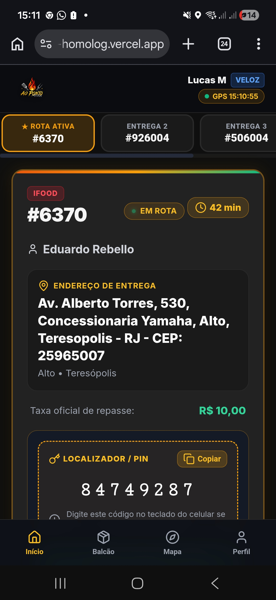
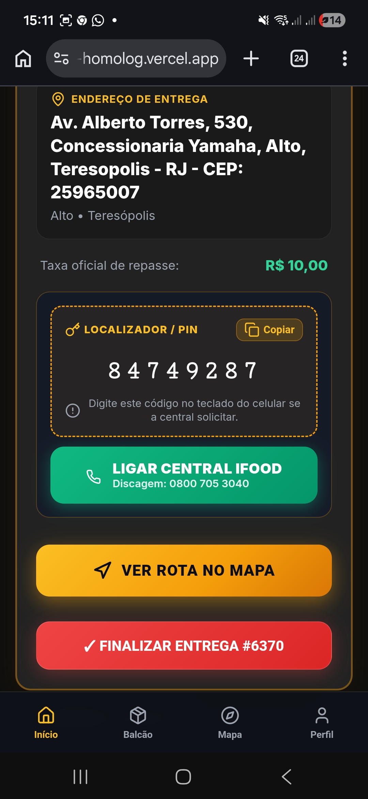
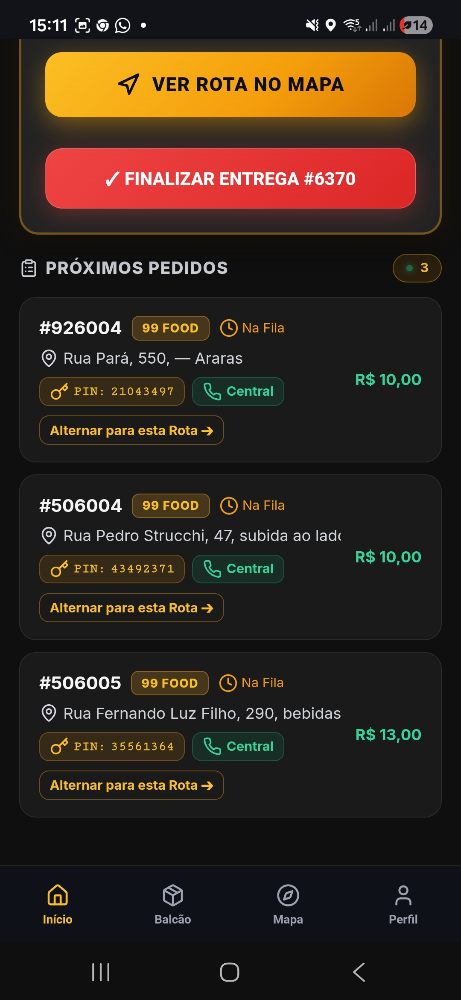
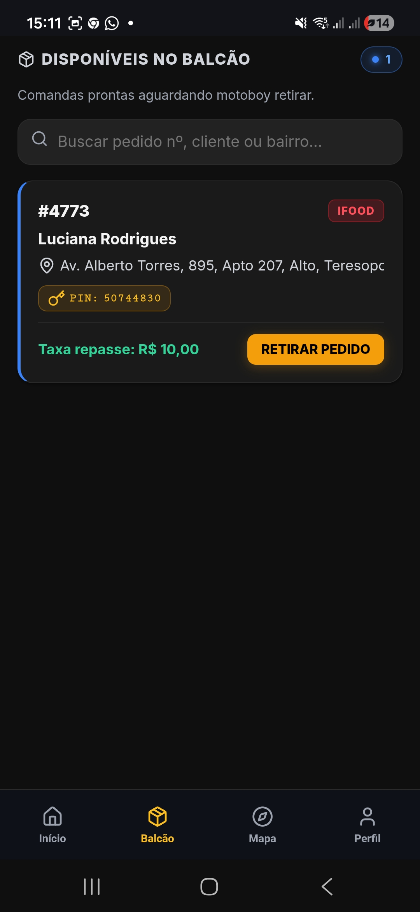
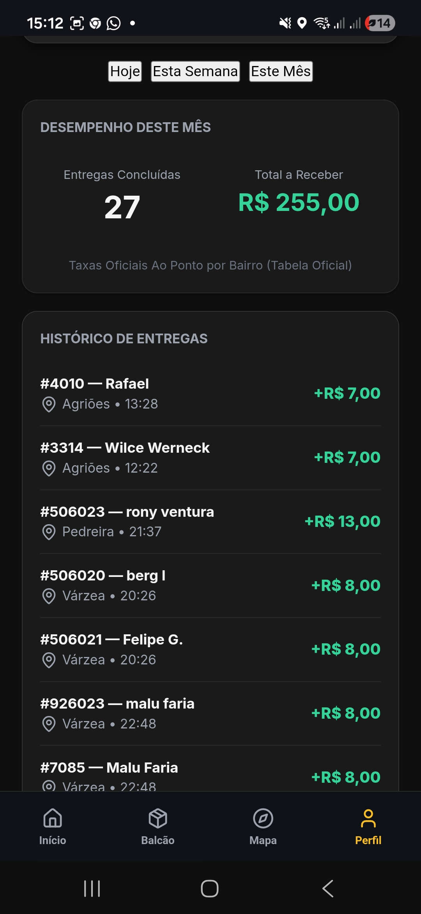

# 🛵 Manual de Instruções do Entregador — Sistema Ao Ponto Entregas

> **Guia Oficial de Operação para Entregadores (Grupos VELOZ & SPEED)**  
> **Restaurante Ao Ponto Carnes — Teresópolis/RJ**

---

## 📌 Sumário
1. [Visão Geral do Sistema](#1-visão-geral-do-sistema)
2. [Primeiro Acesso, Cadastro e Permissão de GPS](#2-primeiro-acesso-cadastro-e-permissão-de-gps)
3. [Tela Início — A Rota Ativa](#3-tela-início--a-rota-ativa)
4. [Contato com o Cliente (PIN, Localizador e Central)](#4-contato-com-o-cliente-pin-localizador-e-central)
5. [Navegação GPS e Conclusão de Entrega](#5-navegação-gps-e-conclusão-de-entrega)
6. [Múltiplas Entregas e Fila de Pedidos](#6-múltiplas-entregas-e-fila-de-pedidos)
7. [Aba Balcão — Retirada Autônoma de Pedidos](#7-aba-balcão--retirada-autônoma-de-pedidos)
8. [Aba Perfil — Fechamento Financeiro e Taxas a Receber](#8-aba-perfil--fechamento-financeiro-e-taxas-a-receber)
9. [Boas Práticas e Resolução de Dúvidas](#9-boas-práticas-e-resolução-de-dúvidas)

---

## 1. Visão Geral do Sistema

O **Ao Ponto Entregas** é o aplicativo web oficial desenvolvido para organizar, agilizar e dar total transparência ao trabalho dos entregadores da **Ao Ponto Carnes**.

Com ele no seu celular, você tem:
- **Acesso direto aos dados de cada entrega**: endereço com número, complemento e ponto de referência.
- **Integração com GPS nativo**: com um clique você abre o Google Maps ou Waze já com a rota pronta.
- **Comunicação com o cliente simplificada**: código Localizador / PIN e botão de discagem direta para as centrais oficiais (0800 iFood e 99Food), sem precisar envolver a equipe da cozinha.
- **Múltiplas entregas simultâneas**: abas para alternar facilmente entre os pedidos que estão na sua bag.
- **Retirada autônoma no balcão**: você mesmo pode assumir as comandas que já estão prontas.
- **Transparência financeira total**: cálculo automático do valor de cada corrida de acordo com a **Tabela Oficial por Bairro**, com histórico completo de repasses a receber.

---

## 2. Primeiro Acesso, Cadastro e Permissão de GPS

### 2.1. Como Criar sua Conta
1. Acesse o link oficial do aplicativo no navegador do seu smartphone.
2. Na tela de login, clique na aba **Cadastrar**.
3. Preencha seus dados:
   - **Nome Completo**;
   - **WhatsApp com DDD** (somente números, ex: 21999999999);
   - **Senha pessoal** para seus futuros acessos.
4. Clique em **CADASTRAR NOVO ENTREGADOR**.

### 2.2. Aprovação Administrativa
- Para garantir a segurança da operação, todos os novos cadastros passam por aprovação da gerência da Ao Ponto.
- Assim que você finalizar seu cadastro, a tela informará que seu acesso está aguardando liberação.
- A administração ativará seu perfil e definirá a sua equipe (**VELOZ** para entrega padrão ou **SPEED** para entregas rápidas).
- Assim que aprovado, basta digitar seu telefone e senha na aba **Entrar** para acessar.

### 2.3. Permissão Obrigatória do GPS
- Ao entrar, o celular exibirá um alerta solicitando permissão para acessar sua localização.
- Selecione sempre a opção **"Permitir durante o uso do app"** (ou "Permitir o tempo todo").
- O GPS é fundamental: é através dele que o sistema atualiza a sua posição no mapa da cozinha e garante o registro correto de saída e chegada de cada corrida.
- No topo direito da tela, um ponto verde com o texto `● GPS [horário]` confirma que seu sinal está transmitindo com perfeição.

---

## 3. Tela Início — A Rota Ativa

Quando você estiver em rota, a tela **Início** exibirá todos os detalhes da comanda atual:

1. **Barra Superior**:
   - Seu nome e o selo da sua equipe (**VELOZ** ou **SPEED**).
   - Horário da última posição GPS transmitida.
2. **Abas de Múltiplas Entregas (Topo)**:
   - Se você estiver transportando mais de um pedido, você verá as abas: **★ ROTA ATIVA #6370**, **ENTREGA 2 #926004**, **ENTREGA 3 #506004**.
   - Você pode alternar entre elas para checar os endereços a qualquer momento.
3. **Cartão Principal do Pedido**:
   - **Selo da Origem**: Indica se o pedido é do **iFood**, **99Food**, **WhatsApp** ou **Cardápio Web**.
   - **Número do Pedido**: Exemplo: `#6370`.
   - **Status e Tempo**: `● EM ROTA` com os minutos decorridos desde a saída.
   - **Nome do Cliente**: Exemplo: *Eduardo Rebello*.
   - **Endereço Completo**: Rua, número, complemento/referência, bairro, cidade e CEP.
   - **Taxa Oficial de Repasse**: Destacada em verde (ex: `R$ 10,00`), calculada pela tabela de bairros.

---

## 4. Contato com o Cliente (PIN, Localizador e Central)

Se você chegar ao local e não conseguir contato imediato pelo interfone ou portaria:

### 4.1. Código Localizador / PIN
- O aplicativo exibe uma caixa tracejada com o **LOCALIZADOR / PIN** (exemplo: `8 4 7 4 9 2 8 7`).
- Toque no botão **Copiar** para copiar o código para a área de transferência do celular se necessário.

### 4.2. Botão "Ligar Central" (iFood / 99Food)
- Toque no botão verde grande **LIGAR CENTRAL IFOOD** (ou **LIGAR CENTRAL 99FOOD**).
- O discador do celular abre direto no telefone oficial de suporte (ex: `0800 705 3040`).
- A chamada é gratuita e protegida.
- Ao ser atendido pela gravação eletrônica, basta digitar o número do **PIN** no teclado de chamada.
- O sistema da central localizará o cliente e fará a ligação para o telefone dele na hora!

> 💡 **Vantagem Operacional**: Você não perde tempo tentando falar com a cozinha, que costuma estar focada no preparo dos pratos. A ligação com o cliente é resolvida diretamente pela central da plataforma.

---

## 5. Navegação GPS e Conclusão de Entrega

### 5.1. Botão "VER ROTA NO MAPA"
- Basta um toque no botão amarelo/dourado **VER ROTA NO MAPA**.
- O sistema abre instantaneamente o seu aplicativo de mapas favorito (Google Maps ou Waze) já com as coordenadas do cliente traçadas.
- Você não precisa digitar nem copiar nenhum endereço.

### 5.2. Botão "FINALIZAR ENTREGA"
- Após entregar o pacote nas mãos do cliente:
  1. Abra o aplicativo Ao Ponto Entregas.
  2. Toque no botão vermelho **✓ FINALIZAR ENTREGA #XXXX**.
  3. A corrida é dada como concluída, o horário final é registrado e o valor do repasse cai imediatamente no seu fechamento financeiro do dia.

---

## 6. Múltiplas Entregas e Fila de Pedidos

Se você pegou 2 ou mais entregas na mesma viagem:
- Rolando a tela Início para baixo, você verá a seção **PRÓXIMOS PEDIDOS**.
- Cada cartão mostra:
  - Número do pedido e plataforma (ex: `#926004 • 99 FOOD`);
  - Endereço de destino e bairro;
  - PIN / Localizador com botão de ligação para a Central;
  - Valor da taxa a receber (ex: `R$ 10,00`, `R$ 13,00`);
  - **Botão "Alternar para esta Rota →"**: Caso você conheça a cidade e perceba que é mais vantajoso entregar outro pedido primeiro, basta clicar neste botão. Ele se tornará a **Rota Ativa** imediatamente e o mapa traçará o novo caminho!

---

## 7. Aba Balcão — Retirada Autônoma de Pedidos

No menu inferior, toque no ícone de caixa **Balcão**:
1. Você verá em tempo real todas as comandas que a cozinha marcou como prontas no balcão.
2. Cada comanda traz o número do pedido, nome do cliente, endereço/bairro e a taxa a receber.
3. Se você for o responsável por aquela saída, toque no botão dourado **RETIRAR PEDIDO**.
4. A comanda é atribuída a você no mesmo segundo e já abre na sua tela inicial pronta para navegação!

---

## 8. Aba Perfil — Fechamento Financeiro e Taxas a Receber

No menu inferior, toque no ícone de usuário **Perfil**:
- Aqui fica o seu extrato de ganhos, com 100% de clareza:
  - **Filtros por Período**: Escolha entre **Hoje**, **Esta Semana** ou **Este Mês**.
  - **Entregas Concluídas**: Total de corridas que você finalizou com sucesso no período selecionado.
  - **Total a Receber**: Valor acumulado em Reais (**R$**) das suas taxas de entrega.
  - **Histórico Completo**: Lista linha por linha de cada corrida concluída, exibindo o número do pedido, cliente, bairro atendido, horário de conclusão e o valor pago (ex: `+R$ 7,00`, `+R$ 8,00`, `+R$ 10,00`, `+R$ 13,00`).

---

## 9. Boas Práticas para o Dia a Dia

1. **GPS Sempre Ativo**: Nunca desative a localização do celular enquanto estiver no turno de entregas.
2. **Conferência na Saída**: Sempre confira o número do pedido no pacote com o número na tela antes de subir na moto.
3. **Finalize na Hora**: Toque em **Finalizar Entrega** logo após entregar o pedido, para que os dados fiquem sincronizados e a cozinha saiba que você já está livre para a próxima viagem.
4. **Use a Central Telefônica**: Se não encontrar o cliente, use o botão da central com o PIN. É o meio mais seguro e resguarda o entregador perante as plataformas.

---
*Ao Ponto Carnes — Qualidade no Prato e Agilidade na Entrega!*
